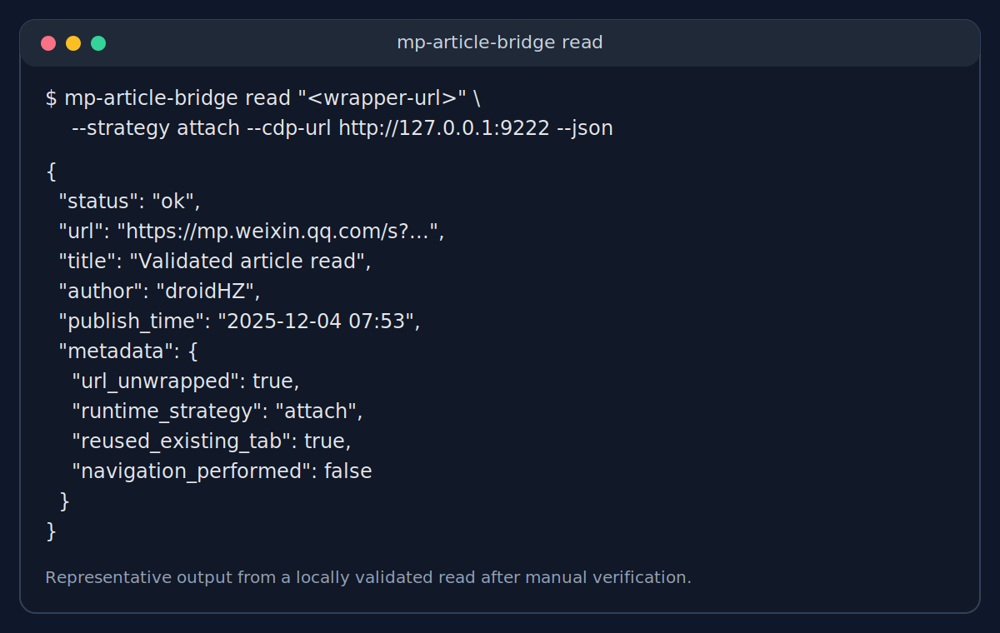
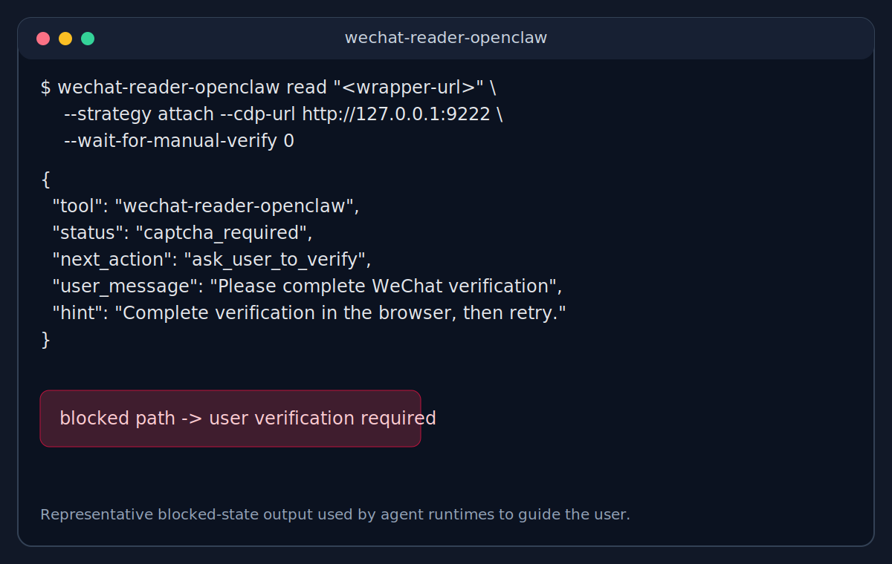
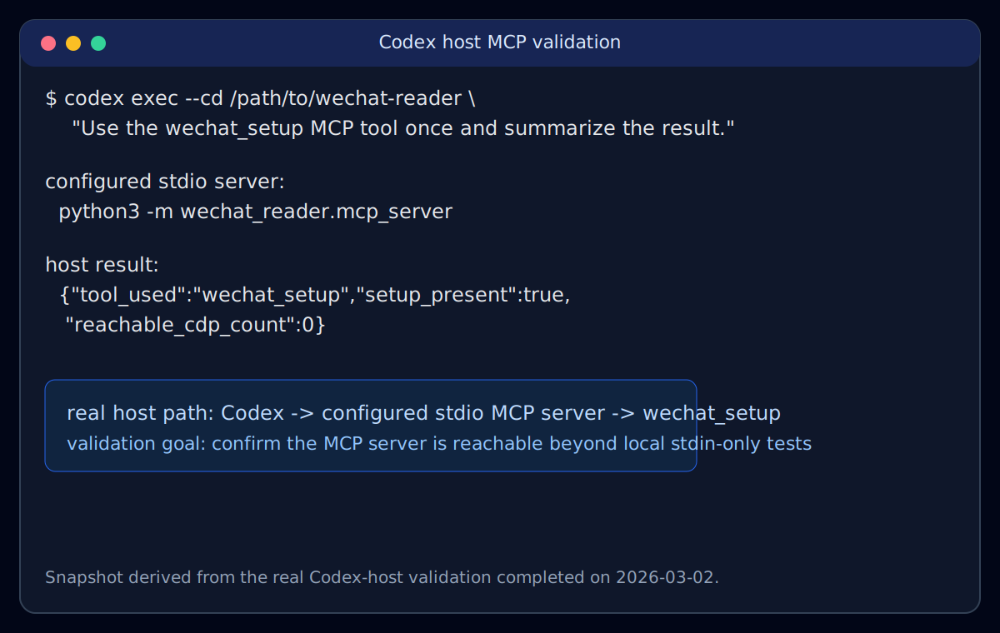

# wechat-reader

面向 AI Agent 的微信公众号阅读工具，提供 CLI、MCP server 和 Python API，可复用用户已登录、已验证的浏览器会话。

`wechat-reader` 适合这样的场景：用户已经有一个真实浏览器窗口可以手动完成微信验证，而 agent 需要一个结构化、可重试、可诊断的阅读接口。

使用入口：

- `wechat-reader`：直接在终端里读取、打开、诊断微信文章页面
- `wechat-reader-mcp`：把同样的能力暴露给 Claude、Codex 等支持 MCP 的宿主
- `wechat_reader`：在你自己的 Python 工具里直接调用

## 快速开始

要求 Python 3.11+。

### 安装

```bash
git clone https://github.com/xiguawang/wechat-reader.git
cd wechat-reader
pip install -e .
python -m playwright install chromium
```

### 通过 CLI 读取文章

```bash
wechat-reader read "https://mp.weixin.qq.com/s?..." --json
```

### 检查本机浏览器环境

```bash
wechat-reader setup
```

### 启动 MCP Server

```bash
wechat-reader-mcp
```

### Python API

```python
from wechat_reader import read_article_sync

result = read_article_sync("https://mp.weixin.qq.com/s?...", strategy="auto", timeout=30)
print(result.status, result.title)
```

## 你会得到什么

- `attach`、`launch`、`playwright`、`auto` 四种浏览器策略
- `ok`、`captcha_required`、`rate_limited` 等结构化状态
- CLI 下的 JSON / Markdown 输出
- 可直接接入 agent 的 MCP server
- 可嵌入你自己工具链的 Python API

## 截图

下面三张图对应当前最重要的三条路径：

### 验证完成后的成功读取



### 需要用户先完成验证的阻塞状态



### 真实 MCP host 接入验证



## 当前状态

当前仓库已经具备一条可工作的主链路：

- CLI：`setup`、`tabs`、`open`、`read`
- 浏览器策略：`auto`、`attach`、`launch`、`playwright`
- Python API
- OpenClaw wrapper
- stdio MCP server
- GitHub Actions CI
- fresh virtualenv 安装验证

已经完成的本地真实验证包括：

- 识别真实微信验证页并返回 `captcha_required`
- 用户手动完成验证后，复用已验证的 Chrome tab 读取正文
- 自动将 `wappoc_appmsgcaptcha?...target_url=...` 解包为真实文章 URL
- 成功保存 markdown 输出
- 真实 Codex host 调用 `wechat_setup`

## MCP Server

项目内置了一个 stdio MCP server：

```bash
wechat-reader-mcp
```

当前暴露的 tools：

- `wechat_read_article`
- `wechat_open_article`
- `wechat_list_tabs`
- `wechat_read_current_tab`
- `wechat_get_status`
- `wechat_setup`

当前暴露的 resources：

- `wechat-reader://setup`
- `wechat-reader://tabs`
- 项目 `README.md`
- OpenClaw 集成 `README.md`

## CLI

### `setup`

```bash
wechat-reader setup
wechat-reader setup --json
```

### `tabs`

```bash
wechat-reader tabs --wechat-only
wechat-reader tabs --wechat-only --json
```

### `open`

```bash
wechat-reader open "https://mp.weixin.qq.com/s?..." \
  --strategy launch \
  --channel chrome \
  --json
```

### `read`

```bash
wechat-reader read "https://mp.weixin.qq.com/s?..." \
  --strategy auto \
  --timeout 30 \
  --json
```

如果输入的是微信验证包装链接，例如 `mp/wappoc_appmsgcaptcha?...&target_url=...`，工具会先解包到真实文章 URL，再做 tab 匹配和导航，避免把已验证页面重新带回验证码入口。

## 限制说明

`wechat-reader` 不是一个承诺“稳定绕过微信风控”的通用抓取器。

- 微信风控可能随时变化
- 某些链接仍然需要用户先手动完成验证
- “操作频繁”是真实运行状态，不是这个工具能彻底消除的问题
- 受限沙箱环境下，CDP attach 可能出现本地 `EPERM`
- 移动端更适合“移动端发起，桌面端 bridge 执行”的模式

## 对外公开前的状态

当前已经达到“可公开仓库并让技术用户试用”的程度，但还不算大范围宣传级别的成熟产品。

已经具备：

- 核心功能可用
- 本地真实验证跑通
- 单元测试通过
- CI 已配置
- MCP 基础接入已完成
- 真实 MCP host 验证已完成
- fresh virtualenv 安装验证已完成

仍建议继续补的内容：

- 决定是否继续保持私有，还是转公开

## 许可证

MIT
